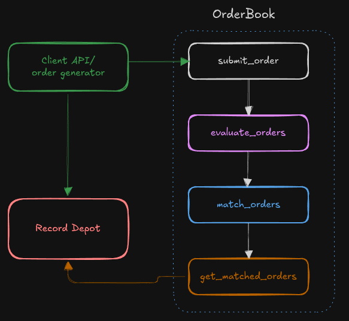
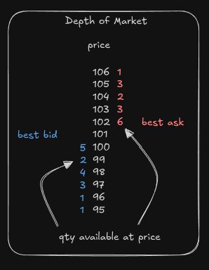
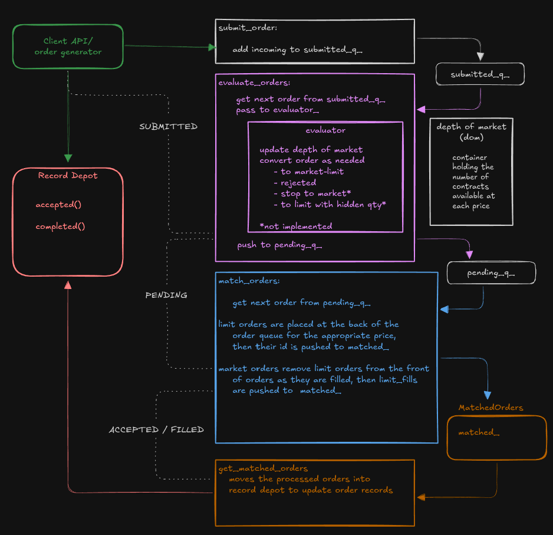

# Orderbook

This is a toy order book based roughly on the [CME's order specifications for futures](https://cmegroupclientsite.atlassian.net/wiki/spaces/EPICSANDBOX/pages/457216217/Order+Management).

I'm building this portfolio project in order to develop a better understanding of:
- compile time polymorphism
- performance testing tools and techniques (see docs/PerformanceNotes.md)
- the performance implications of copy, move and assign operations along with RVO
- move and value semantics
- minimizing data dependency in order to move to a multithreaded implementation
- Assembly instructions
- CPU caching / performance with varying amounts of data

** Wanting to focus on the above for this project I've left off most of the order functionality that involves holding an order until some future time and resubmitting. This includes:
- Stop orders 
- Hidden limit order quantities
- Orders cancelled at some future time (DAY, GTD)


### Run the demo

If you just want to run the demo:


#### Cmake

From project root create a build directory, then cd into it

```angular2html
mkdir build
cd build
```
Build the project
```angular2html
cmake --build .
```

Run the demo
```angular2html
./demo
```


### The Broad Strokes

At it's most basic the project has three modules:
- the Order Generator
    - randomly makes the orders we process in the Order Book
- the Order Book
    - consisting of several sub modules for processing orders
- the Record Depot
    - tables and access methods allowing us to query processed orders



### Quick Primer: What's an Order Book? How does it work?

An Order Book is a collection of containers and method that manages the buying and selling of orders on a given security.

There are two types of orders: Limit and Market

A Limit order is a quantity with a price representing the worst price the participant is willing to buy/sell at
- Buyers place limit orders at prices they're willing to purchase the security at.
    - the highest price with a buy limit order is called the bid
- Sellers place limit orders at prices they're willing to sell the security at.
    - the lowest price with a sell limit order is called the ask

The depth of market (dom), is a container holding the total number of contracts available for buying/selling at each price




The bid and the ask comprise the price of a security at any given moment
- if you wanted to buy the security right now, you would pay the ask price (102)
- if you wanted to sell the security right now, you'd take the bid price (100)

Buying / selling the security at the best available price is called a market order
- buy market orders pay the ask price
- sell market orders pay the bid price

The number of units available for buying / selling at any given price is called the depth.

If a market order is larger than the depth at the current best price
- it moves on to the next price
- and we calculate an average price for the market order based on how many units are executed at each price
- for example: if we bought all 6 contracts at 102 and then 2 of the contracts at 103, our average fill price would be 102.25

But there's a limit to how many prices a single market order can consume
- This price can be specified by the user as the limit price; it's the worst price the user is willing to pay.
- Otherwise it defaults to the price +/- protection
    - [protection](https://cmegroupclientsite.atlassian.net/wiki/spaces/EPICSANDBOX/pages/457087412/Order+Types+for+Futures+and+Options#OrderTypesforFuturesandOptions-ProtectionFunctionalityforMarketandStopOrders) is the maximum number of prices that the market can move in one trade. It's set at the beginning of each day for each instrument. 
    - For instance:
        - a buyer enters a market order at 101 with a large enough quantity to take all of the limit orders through 105.
        - However, the protection is 4, so the maximum price the buyers order will execute at market at is 104.
        - Once the market order has taken all of the sell limit orders at 104, it's remaining quantity(1) is converted to a buy limit order
        - taken together we would say that the buy market order has been converted to a market limit order


Similarly, when a limit order is placed at a price that's worse than the best market price, but still within the protection range
- it executes like a market order, but it stops at the limit price submitted with the order.
- this is often referred to as "crossing the spread"


Limit orders whose price falls on the wrong side of the protection price are rejected
- buy limit orders at a price > ask + protection
- sell limit orders at a price < bid - protection


### Order Path Detail



### Description of modules
#### Value Types

The core values in each order. The idea, in theory, is to keep the order object's size to 8 bytes to maximize efficiency in regards to page look ups and cache locality. As such each order has an
- ID: unsigned integer, 4 bytes
- Qty: unsigned short integer, 2 bytes
- Price: unsigned short integer, 2 bytes
    - we treat Price as an integral type
    - this allows us to treat vector indices as prices
        - That is index 0 (plus a small offset) of our price container represents the minimum tradeable price for the instrument for the day
        - And index at size - 1 (minus a small offset) represents the maximum trade - able price for the instrument for the day
        - Price can then easily be converted into a standard floating point value as part of the UI, though that is not implemented here

#### Order States

SUBMITTED
- the order has been received, but has not been added to the order book and still may be rejected
- An order received via the submit_order interface is of type Submitted and is pushed into a queue of Submitted orders until it can be evaluated and accepted/rejected
- In this project, every order starts with the state SUBMITTED

ACCEPTED
- The order has been evaluated, added to the pending queue, then added to the order book as a limit order
- Accepted orders are placed in the Record Depot accepted table

REJECTED
- The order has been evaluated and NOT placed on the order book
- Rejected orders are placed in the Record Depot completed table

FILLED
- The order has been executed in full and there is no quantity remaining
- Filled orders are placed in the Record Depot completed table

PARTIAL
- A part of the order has been executed, but some quantity remains as a limit order
- Partial orders are placed in the Record Depot accepted table

CANCELLED
- The order has been removed from the order book
- An order must be ACCEPTED before being cancelled
- Occurs via the Cancel order type
- Cancelled orders are placed in the Record Depot completed table


#### Order Types

Order
- The "base" order object
- An order has an id, quantity and price

We declare several empty structs for
- BUY, SELL, LIMIT, MARKET, and CANCEL
- Then we use a variadic template to wrap Order and apply an alias to each to get our order types:
    - BuyLimit
    - SellLimit
    - BuyMarket
    - SellMarket
    - BuyMarketLimit (pending only)
    - SellMarketLimit (pending only)
    - Cancel
    - Rejected (pending only)

We then group this set of orders together with std::variant into
- Submitted and Pending orders
- which allows us to queue the different order types together


#### Matched Orders

Orders that have been evaluated and passed through the matcher are collected in a MatchedOrders object.

This includes:
- market_fills
  - completely or partially filled market orders 
- partial_fills
  - partially filled limit orders
- filled_limit_orders
  - completely filled limit orders
- state_updates
  - ACCEPTED limit orders
  - CANCELLED limit orders
  - REJECTED limit orders

Matched Orders are collected inside the Matcher, then copied out to the Orderbook's matched_ container once the matching sequence is complete

#### Generators

simple order simulation and recording

#### Instrument

A stand in for a collection of information about a trading instrument

For this project we only care about the number of prices, but theoretically this is where you would load in an existing set of orders, set min / max prices, etc.

#### Fifo (Matcher)

Our matching strategy: First In, First Out
Consists of:
- a container of Levels holding order information at each price
- a set of functions to add, remove, and change the quantity of the orders
- a MatchedOrders object holding the result of the matching sequence 
- each Level consists of:
    - a container of all the orders at that price
    - depth: the total number of contracts available at the price
    - count: the number of orders at the price

#### Order Book

Receives and executes orders, then outputs the results of each trade
Consists of:
- Depth of market (Dom)
    - a container with the total number of available contracts at each price
    - the best prices participants are willing to buy (bid) or sell (ask)
    - the maximum number of prices a market order can execute over at once (protection)
- An interface for querying the Dom
- Evaluator
    - a set of functions for
        - updating the Dom when new orders are excepted
        - rejecting orders
        - splitting market and limit orders into market limit orders where appropriate
- A Matching strategy
    - different markets use different algorithms to match orders
    - so we inject our matcher into the order book via a template
    - we use our Matcher Concept file to define the required interface a matching strategy must have
    - our strategy is First In, First Out (Fifo), see above
- Containers for holding orders in various states of process

```
submitted_q_
pending_q_
matched_

```


#### Record

There's a lot of information we'd want associated with each order that we wouldn't want clogging up the order book. That information goes here.
- for this project that includes timestamps, state changes, fill price, etc
- but this where you'd include stuff we're not concerned about like duration, linking to a broker/ account id, etc

Records are created at generation and added to the Record Depot before being submitted to the Orderbook.

#### Record Depot

Sort of a combo mock db and hot storage

Centers around two hash tables
- accepted, which holds
    - unfilled limit orders
    - partially filled orders
- completed, which holds
    - filled orders
    - cancelled orders
    - rejected orders

Also provides
- find_order(id) which searches both tables and returns the Record of the passed id
- last_processed() which returns a set of the order ids processed on the last trade

#### Overwriting Vector
*added 8/25/25*

When profiling order processing, one of the first things that jumped out were the memory allocations, particularly around the limit_fills vector inside MatchedOrders and the matched_ container inside OrderBook.

The Overwriting Vector (OV) simply wraps a vector and maintains a separate end_ variable. 
- the OV's elements can only ever be overwritten, they cannot be removed or moved from
  - the move constructor is marked deleted
  - calling clear() sets end_ to 0, but does not alter the underlying vector
- push_back() copies the passed element index end_, then increments end_, expanding the underlying vector as needed
    - likewise the copy assign operator sets the destination's end_ variable to 0 then calls push_back for each element in the source

### Looking ahead

As this project has a performance element, one of the next steps will be moving it towards a multi-threaded version. The image below shows roughly how I envision the work being broken up.


The part I'm most concerned with at the moment are threads 2 and 3. This is my conceptual "hot path." 

